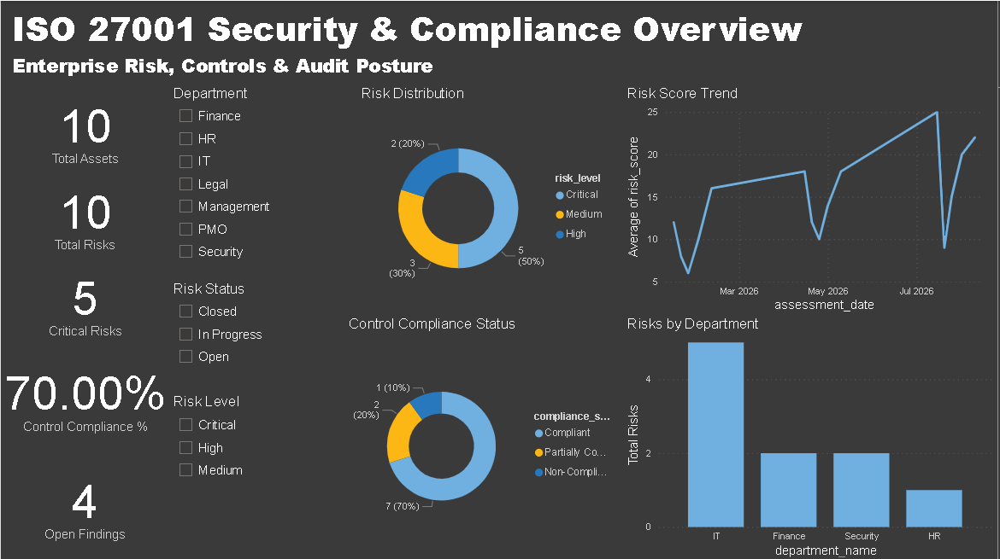
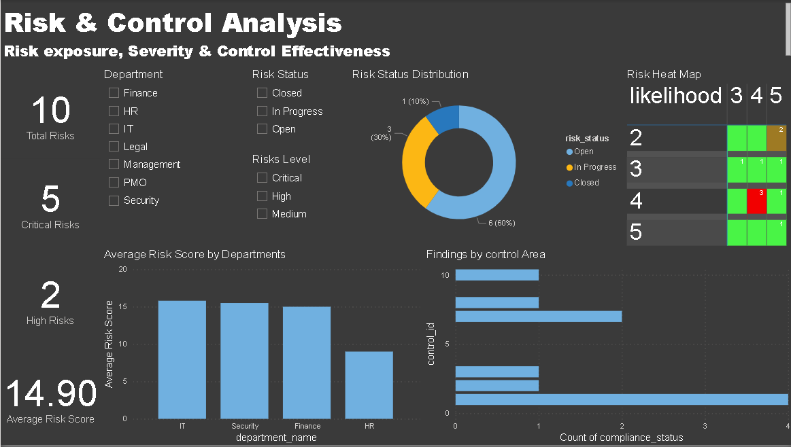
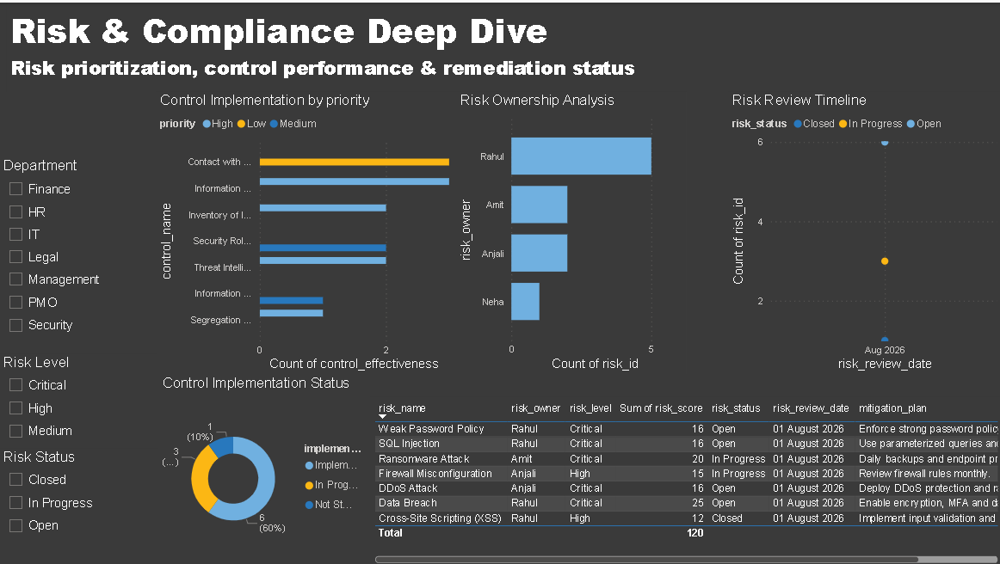

# ISO 27001 Risk & Compliance Analytics System

An end-to-end **Governance, Risk, and Compliance (GRC) analytics project** built using SQL and Power BI to monitor organizational risks, assets, security controls, audit findings, and compliance performance.

The project combines a relational database, analytical SQL queries, DAX-based KPIs, data validation, and an interactive three-page Power BI dashboard to transform security and compliance data into actionable business insights.

---

## 📌 Project Overview

Organizations following information-security frameworks such as **ISO 27001** need to continuously monitor:

- Organizational assets
- Information-security risks
- Security controls
- Control implementation and compliance
- Audits
- Audit findings
- Risk assessments
- Risk remediation and review activities

Managing these elements across multiple relational tables can make it difficult to identify critical risks, monitor control performance, track audit findings, and understand the overall security posture.

This project addresses this problem by creating a centralized **Risk & Compliance Analytics System** that integrates SQL-based data management and analysis with an interactive Power BI dashboard.

---

## 🎯 Objectives

The main objectives of the project are:

- Design a structured relational database for risk and compliance management.
- Maintain information about departments, assets, risks, controls, audits, and findings.
- Analyze risk severity using likelihood, impact, and risk scores.
- Track security-control implementation and compliance.
- Monitor audit findings and their remediation status.
- Analyze historical risk assessments.
- Identify critical and high-priority risks.
- Calculate control compliance and effectiveness metrics.
- Provide department-level risk analysis.
- Build an interactive Power BI dashboard for management and GRC analysis.
- Validate Power BI calculations against SQL results.
- Perform database and data-quality validation.

---

## 🛠️ Technology Stack

| Technology | Purpose |
|---|---|
| SQL / MySQL | Database design, data storage and analytical queries |
| SQL Window Functions | Ranking, risk comparison and historical analysis |
| Power BI | Interactive dashboards and data visualization |
| DAX | KPIs, compliance metrics and analytical calculations |
| GitHub | Project documentation and version control |

---

# 🗄️ Database Design

The project uses a relational database to organize security and compliance information into multiple related entities.

### Core entities include:

- Departments
- Assets
- Risks
- Controls
- Audits
- Audit Findings
- Asset-Control relationships
- Risk-Control relationships
- Risk Assessment History

The database follows a relational structure where dimension/master tables provide descriptive information and transactional/fact tables capture risk, control, assessment, and audit activity.

---

## 🔗 Data Model

The major relationships are structured around assets, risks, controls, departments, and audit information.

Conceptually:

```text
                    Departments
                         │
                         ▼
                       Assets
                    /     │      \
                   /      │       \
                  ▼       ▼        ▼
                Risks   Asset     Audit
                        Controls  Findings
                  │       │       │
                  ▼       ▼       ▼
             Risk       Controls  Audits
             History
                  │
                  ▼
             Risk Controls
```


# 📊 **SQL Analysis**

SQL was used extensively to analyze the risk and compliance dataset before visualization.

## **Key SQL concepts used include:**

SELECT
WHERE
GROUP BY
ORDER BY
Aggregate Functions
JOINs
Common Table Expressions (CTEs)
Window Functions
ROW_NUMBER()
RANK()
DENSE_RANK()
LAG()
AVG()
SUM()
Conditional aggregation

# 🔍 **Key SQL Analysis Performed**

## **Department Risk Analysis**

Calculated average risk scores for each department to identify areas with higher risk exposure.

## **Risk Ranking**

Used window functions to rank risks within departments and identify the highest-priority risks.

Example:

ROW_NUMBER() OVER (
    PARTITION BY department_name
    ORDER BY risk_score DESC
)

## **Risk Comparison**

Used LAG() to compare the current risk score with the previous assessment.

Conceptually:

Current Risk Score - Previous Risk Score

This helps identify whether risk exposure is increasing or decreasing over time.

## **Historical Risk Analysis**

Risk assessment history was analyzed to understand changes in organizational risk over multiple review dates.

## **Audit Findings Analysis**

Audit findings were analyzed according to:

Finding status
Severity
Associated asset
Associated control
Associated audit

## **Control Compliance Analysis**

Control implementation and compliance were analyzed to calculate:

Compliant controls
Non-compliant controls
Control compliance percentage
Control implementation status

# 📈 **Power BI Dashboard**

The final Power BI solution consists of three interactive dashboard pages.

## 🏠**Page 1 — Executive Overview**

The Executive Overview provides a high-level view of the organization's security and compliance posture.


Key KPIs
Total Assets
Total Risks
Critical Risks
Control Compliance %
Open Findings
Visualizations
Risk Distribution
Control Compliance Status
Average Risk Score Trend
Risks by Department
Interactive Features
Department slicer
Risk Level slicer
Risk Status slicer
Cross-filtering between visuals
Purpose

This page is designed for management-level users who need a quick understanding of the organization's overall risk and compliance posture.

## ⚠️**Page 2 — Risk & Control Analysis**

This page provides deeper analysis of risk exposure and control performance.



Key KPIs
Total Risks
Critical Risks
High Risks
Average Risk Score
Visualizations
Risk Status Distribution
Risk Severity Matrix
Risk Heat Map
Average Risk Score by Department
Findings by Control Area / Control-related analysis
Risk Heat Map

A likelihood-versus-impact matrix was created to visualize risk concentration.

The matrix uses:

Rows    → Likelihood
Columns → Impact
Values  → Count of Risks

Conditional formatting is used to create a heat-map effect and identify areas of higher risk concentration.

Interactive Features
Department filtering
Risk-level filtering
Risk-status filtering
Cross-filtering between analytical visuals

## 🔎**Page 3 — Risk & Compliance Deep Dive**

The third page provides operational-level analysis of risks, ownership, control implementation, and high-priority risks.


Interactive Filters
Department
Risk Level
Risk Status
Visualizations
Risk Ownership Analysis
Risk Review Timeline
Control Implementation Status
Control Implementation by Priority
High & Critical Risk Details Table
Detailed Risk Table

The detailed table provides information such as:

Risk Name
Risk Owner
Risk Level
Risk Score
Risk Status
Risk Review Date
Mitigation Plan

This allows users to move from high-level analysis to actionable risk information.

# 🧪**Data Validation & Testing**

Data quality and analytical consistency were validated before finalizing the dashboard.

Primary Key Validation

Duplicate checks were performed for major identifiers including:

asset_id
risk_id
control_id

No duplicate primary-key values were found.

Referential Integrity

Foreign-key relationships were checked for orphan records, including:

Assets → Departments
Risks → Assets
Findings → Assets
Findings → Audits
Findings → Controls

No orphan records were identified.

Risk Score Validation

Risk scores were validated using:

Risk Score = Likelihood × Impact

No inconsistent risk-score records were identified.

## **SQL vs Power BI Validation**

Important dashboard metrics were cross-checked against SQL calculations.

Validated metrics included:

Total Risks
Critical Risks
High Risks
Average Risk Score
Total Findings
Open Findings
Closed Findings
Compliant Controls
Non-Compliant Controls
Control Compliance %

The Power BI results matched the corresponding SQL calculations.

# 📌**Key Project Results**

The completed dashboard provides visibility into:

Overall organizational risk exposure
Critical and high-risk populations
Department-level risk concentration
Risk score trends
Control compliance
Control implementation
Audit findings
Risk ownership
Risk review timelines
High-priority risks requiring attention

The project demonstrates how relational security data can be transformed into an interactive analytical solution for GRC decision-making.

# 💡**Business Recommendations**

Based on the analytical framework, organizations can use the dashboard to:

1. Prioritize Critical Risks

Critical and high risks should receive priority during remediation planning and management reviews.

2. Monitor Non-Compliant Controls

Non-compliant controls should be reviewed regularly and assigned clear remediation owners.

3. Focus on High-Risk Departments

Departments with consistently higher average risk scores should receive additional risk assessments and control reviews.

4. Track Audit Findings

Open and overdue findings should be monitored regularly to ensure timely remediation.

5. Monitor Risk Trends

Increasing risk scores over multiple assessments may indicate deteriorating control effectiveness or increasing exposure.

6. Improve Control Implementation

Controls with incomplete or ineffective implementation should be prioritized for remediation.

# 🏗️**Project Architecture**
                ┌─────────────────────┐
                │   Relational DB     │
                │      SQL/MySQL      │
                └──────────┬──────────┘
                           │
                           ▼
                ┌─────────────────────┐
                │    SQL Analysis     │
                │  CTEs / Joins /     │
                │  Window Functions   │
                └──────────┬──────────┘
                           │
                           ▼
                ┌─────────────────────┐
                │      Power BI       │
                │      Data Model     │
                └──────────┬──────────┘
                           │
                           ▼
                ┌─────────────────────┐
                │    DAX Measures     │
                │  KPIs & Analytics   │
                └──────────┬──────────┘
                           │
                           ▼
                ┌─────────────────────┐
                │ Interactive GRC     │
                │     Dashboard       │
                └─────────────────────┘

## **Potential future improvements include:**
Automated data ingestion from GRC systems
Automated audit-finding notifications
Real-time risk monitoring
Risk remediation tracking
Predictive risk analysis
Automated compliance reporting
Integration with cloud security platforms
Integration with SIEM solutions
Automated ISO 27001 compliance scoring
Role-based dashboard access
Scheduled Power BI refresh
🎓 Skills Demonstrated

## **This project demonstrates practical experience with:**

Data Analytics
Data modeling
Data validation
KPI development
Business intelligence
Dashboard design
SQL
Relational database design
JOINs
CTEs
Aggregations
Window functions
Ranking
Historical comparisons
Data-quality validation
Power BI
Data modeling
Relationships
Interactive dashboards
Slicers
Conditional formatting
Heat maps
Cross-filtering
Dashboard design
DAX
CALCULATE
DIVIDE
DISTINCTCOUNT
AVERAGE
COUNTROWS
Filter context
Time/risk analysis
GRC / Cybersecurity
Risk assessment
Risk scoring
Security controls
Control compliance
Audit findings
Risk ownership
Risk remediation
ISO 27001 concepts

# 🏁**Conclusion**

The ISO 27001 Risk & Compliance Analytics System demonstrates an end-to-end approach to transforming structured security and compliance data into actionable business intelligence.

By combining SQL, data modeling, analytical queries, DAX, and Power BI, the project provides a centralized view of organizational risk, control implementation, compliance, and audit findings.

The resulting three-page interactive dashboard enables users to move from executive-level security posture to detailed risk and control analysis and finally to operational risk-level information.

This project demonstrates the practical application of Data Analytics, Business Intelligence, SQL, Power BI, and GRC/Cybersecurity concepts in a single end-to-end solution.

## 👨‍💻 **Author**

**Pranav Aggarwal**

**MCA | Data Analytics | Cybersecurity | GRC**

### ⭐**If you found this project useful, consider giving the repository a star.**
